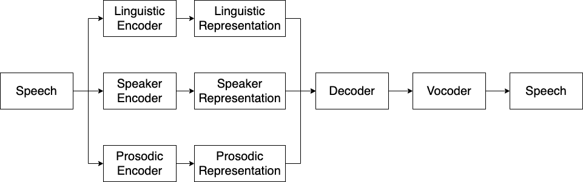

# **EasyVC**

**Work in progress.**

A voice conversion framework for different types of encoders, decoders and vocoders. 

The encoder-decoder framework is demonstrated in the following figure. 

More specifically, three encoders are used to extract representations from speech, including a linguistic encoder, a prosodic encoder and a speaker encoder.
Then a decoder is used to reconstruct speech mel-spectrograms. 
Finally, a vocoder converts mel-spectrograms to waveforms. 
Note that this repo also supports decoders that directly reconstruct waveforms (e.g. VITS), in these case, vocoders are not needed. 


This repo covers all the steps of a voice conversion pipeline from dataset downloading to evaluation.

I am currently working on my own to maintain this repo. I am planning to integrate more encoders and decoders.

Please be aware that this repo is currently very unstable and under very fast developement.


# Conda env

create a conda env
```
conda create --name torch_1.9 --file requirements.txt
```


# Working progress

- **Dataset**
    - [x] VCTK
    - [x] LibriTTS
    - [ ] M4Singer
    - [ ] NUS-48E
    - [ ] NHSS

- **Linguistic Encoder**
    - [x] conformer_ppg from [ppg-vc](https://github.com/liusongxiang/ppg-vc)
    - [x] vq-wav2vec from [fairseq](https://github.com/facebookresearch/fairseq)
    - [x] hubert_soft from [soft-vc](https://github.com/bshall/soft-vc)
    - [x] contentvec_100 from [contentvec](https://github.com/auspicious3000/contentvec)
    - [x] contentvec_500 from [contentvec](https://github.com/auspicious3000/contentvec)
    - [x] whisper_ppg from [whisper_ppg](https://github.com/PlayVoice/whisper_ppg)
 
 
- **Prosodic Encoder**
    - [x] log-f0 from [ppg-vc](https://github.com/liusongxiang/ppg-vc)
    - [x] pitch + energy from [fastspeech2](https://github.com/ming024/FastSpeech2)
 
 
- **Speaker Encoder**
    - [x] d-vector from [ppg-vc](https://github.com/liusongxiang/ppg-vc)
    - [x] ECAPA-TDNN from [speechbrain](https://github.com/speechbrain/speechbrain/tree/develop/recipes/VoxCeleb)
 
 
- **Decoder**
    - [x] fastspeech2 from [fastspeech2](https://github.com/ming024/FastSpeech2)
    - [x] taco_ar from [s3prl-vc](https://github.com/s3prl/s3prl/tree/main/s3prl/downstream/a2a-vc-vctk)
    - [x] taco_mol from [ppg-vc](https://github.com/liusongxiang/ppg-vc)
    - [x] vits from [vits](https://github.com/jaywalnut310/vits)
    - [x] grad_tts from [Grad_TTS](https://github.com/huawei-noah/Speech-Backbones)
    - [x] diffwave from [DiffWave](https://github.com/lmnt-com/diffwave)
 
 
- **Vocoder**
    - [x] hifigan (vctk) from [ppg-vc](https://github.com/liusongxiang/ppg-vc)
    - [ ] BigVGAN from [bigvgan](https://github.com/NVIDIA/BigVGAN)

- **Evaluation**
    - [x] UTMOS22 mos prediction from [UTMOS22](https://github.com/sarulab-speech/UTMOS22)
    - [x] ASR WER
    - [x] ASV EER
    - [ ] MCD, F0-RMSE, F0-CORR
# How to run

## Step1: Dataset download 
This part of codes are mostly from [parallel_wavegan](https://github.com/kan-bayashi/ParallelWaveGAN)

```
./bin/download_vctk_dataset.sh
```

Or

```
./bin/download_libritts_dataset.sh
```
## Step2: Generate metadata.csv

```
./bin/preprocess_vctk.sh
```
Or
```
./bin/preprocess_libritts.sh
```

## Step3: Extract features

A ESPNET style bash script has been provided for extracting features, including spectrograms, linguistic, speaker, and prosodic representations.
Before start extracting features, you need to decide the setups of your encoders, decoder and vocoder.

e.g.
```
./extract_features.sh --stage 1 \
                      --stop_stage 4 \
                      --dataset vctk \
                      --linguistic_encoder vqwav2vec \
                      --speaker_encoder utt_dvec \
                      --prosodic_encoder ppgvc_f0 \
                      --decoder fastspeech2 \
                      --vocoder ppgvc_hifigan
```
Options:
- dataset: 
    - vctk 
    - libritts
- speaker_encoder: 
    - utt_dvec
    - utt_ecapa_tdnn
- linguistic_encoder: 
    - vqwav2vec
    - conformer_ppg 
    - hubert_soft
    - contentvec_100
    - contentvec_500
    - whisper_ppg
- prosodic_encoder: 
    - ppgvc_f0 
    - fastspeech2_pitch_energy
- decoder:
    - fastspeech2
    - taco_ar
    - taco_mol
    - vits
- vocoder:
    - ppgvc_hifigan
    - vctk_hifigan
    - libritts_hifigan
    

## Step4: Training

To run training, you need to select a config file from `configs/`. 
The config files are named following the format `${dataset}_${linguistic_encoder}_${speaker_encoder}_${prosodic_encoder}_${decoder}_${vocoder}`
E.g.
```
./bin/train.sh configs/vctk_vqwav2vec_uttdvec_ppgvcf0_fs2_ppgvchifigan.yaml
```


# Authors

- Mingjie Chen, University of Sheffield
- Prof. Thomas Hain, University of Sheffield
